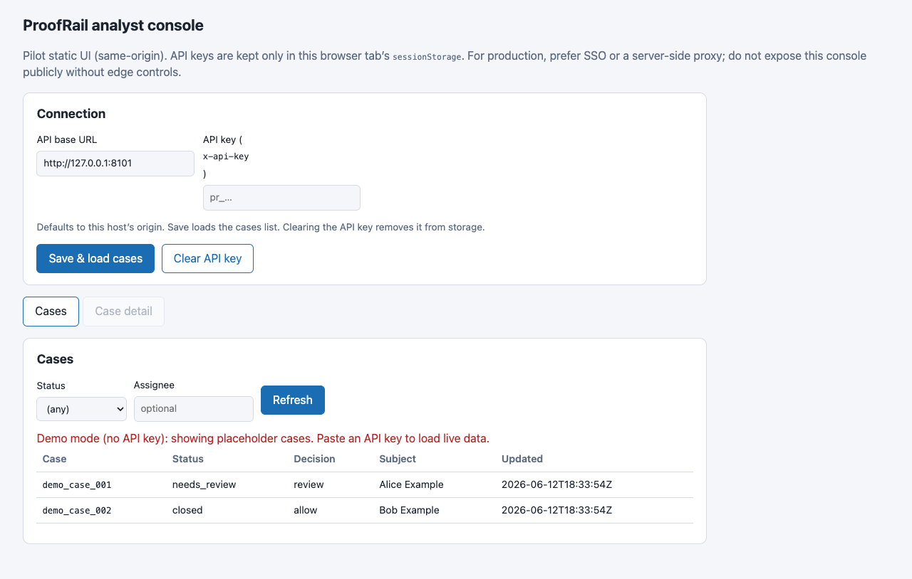
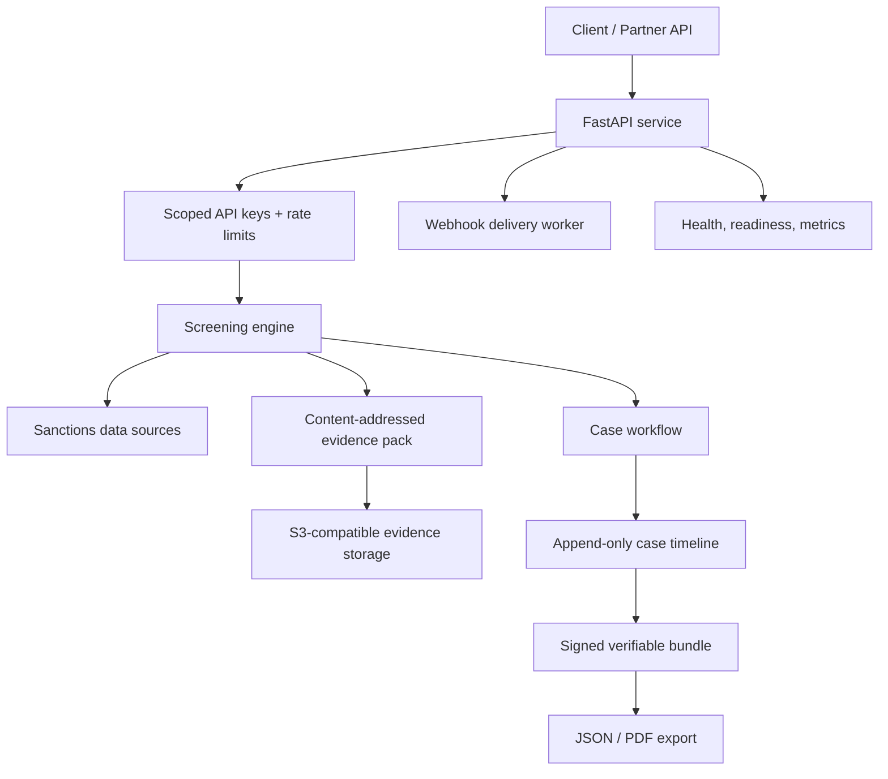

# ProofRail Evidence API

[](https://github.com/giselleevita/proofrail-evidence-api/actions/workflows/ci.yml)
[](https://github.com/giselleevita/proofrail-evidence-api/actions/workflows/deploy.yml)


> FastAPI service for producing signed, verifiable evidence bundles for compliance workflows.

**ProofRail** is an API for producing signed, verifiable evidence bundles for security and compliance workflows. It demonstrates how AI and security systems can produce audit-ready records instead of unverifiable logs.

Most screening and governance systems return only a decision. ProofRail also returns **portable proof** of how that decision was reached — shareable with banking partners, auditors, and internal compliance review.



---

## Positioning

| Layer | Project | Role |
|---|---|---|
| **Enforce** | [agent-security-gate](https://github.com/giselleevita/agent-security-gate) | Runtime tool-call policy gateway |
| **Evaluate** | [vendor-red-team-passport](https://github.com/giselleevita/vendor-red-team-passport) | LLM vendor red-team reports |
| **Govern** | [security-compliance-copilot](https://github.com/giselleevita/security-compliance-copilot) | Cited governance Q&A (not enforcement) |

ProofRail is designed for systems where logs alone are not enough and decisions need to be independently verifiable.

---

## What It Does

You send a subject (name + optional metadata) and get back:

- **A decision**: `allow | block | review`
- **An evidence pack** (content-addressed, exportable as JSON or auditor-ready PDF)
- **A case workflow** (v2): analyst records a decision with an append-only event timeline
- **Verifiable bundles**: signed bundle containing evidence pack + case timeline + tamper-evident hash-chain

ProofRail is built as a compliance evidence service, not a generic sanctions demo. The product goal is to make a screening decision explainable, reproducible, and exportable when a bank, auditor, or internal risk committee asks why a customer was allowed, blocked, or sent to review.

---

## Reviewer Quick Start

For a fast technical review:

1. Read the architecture and security controls below.
2. Run `pytest` to verify the API, case workflow, bundle signing, and webhook behavior.
3. Start the service locally and open `/docs` to inspect the v1 screening and v2 case APIs.
4. Review [`DEPLOYMENT.md`](DEPLOYMENT.md), [`SECRETS_SETUP.md`](SECRETS_SETUP.md), and [`docs/compliance/`](docs/compliance/) for production posture.

The key engineering signal is not just the screening endpoint. It is the full evidence lifecycle: scoped API keys, append-only case events, content-addressed evidence packs, signed bundles, key rotation, hardened deployment settings, and operational documentation.

For component boundaries, trust boundaries, and production tradeoffs, see
[`docs/architecture.md`](docs/architecture.md).

---

## Architecture



### Runtime Posture

| Layer | Production stance |
|---|---|
| API | FastAPI service with scoped API keys and per-key rate limits |
| Database | Postgres for API keys, cases, idempotency, jobs, webhooks, and audit records |
| Storage | S3-compatible object storage for evidence artifacts |
| Worker | Background webhook delivery and retry processing |
| Console | Disabled by default in Railway example; enable only for demos or behind edge auth |
| Observability | `/healthz`, `/readyz`, optional Prometheus `/metrics`, admin metrics endpoint |

---

## Core Artifacts

| Artifact | Description |
|---|---|
| Evidence Pack | Deterministic JSON payload stored as a content hash; exportable as PDF |
| Case Timeline | Append-only events: screening created, comments, assignment, review decision |
| Case Bundle | `{bundle, signature}` — evidence pack + case + chained events + `key_id` for rotation |

---

## Quick Start

```bash
git clone https://github.com/giselleevita/proofrail-evidence-api
cd proofrail-evidence-api
python3 -m venv .venv
source .venv/bin/activate
pip install -U pip && pip install -e ".[dev]"

export PROOFRAIL_ADMIN_KEY="dev-admin"
export PROOFRAIL_SIGNING_SECRET="dev-signing-secret"
export PROOFRAIL_SIGNING_KEYS="k1:dev-signing-secret"
export PROOFRAIL_SIGNING_KEY_CURRENT="k1"
export PROOFRAIL_DB_PATH="./proofrail.db"
export PROOFRAIL_STORE_DIR="./proofrail_store"

proofrail-evidence-api
```

Open:
- `http://127.0.0.1:8000/docs` — Swagger UI
- `http://127.0.0.1:8000/console/` — Analyst console (pilot UI)

### Docker

```bash
cp .env.example .env  # edit values
docker compose up -d --build
```

---

## API Reference

### v1 — Screening

```bash
# Create API key (admin)
curl -sS -X POST "http://localhost:8000/v1/admin/keys" \
  -H "x-admin-key: dev-admin" \
  -H "content-type: application/json" \
  -d '{"customer_id":"demo","scopes":["write:screen","read:evidence"]}'

# Screen a subject
curl -sS -X POST "http://localhost:8000/v1/sanctions/screen" \
  -H "x-api-key: <paste-key>" \
  -H "content-type: application/json" \
  -d '{"subject":{"name":"John Doe","country":"US"}}'
```

### v2 — Cases + Bundles

| Method | Endpoint | Description |
|---|---|---|
| `POST` | `/v2/screenings` | Create screening |
| `GET` | `/v2/cases?status=needs_review` | Case queue |
| `GET` | `/v2/cases/{case_id}` | Case detail |
| `POST` | `/v2/cases/{case_id}/events` | Add case event |
| `GET` | `/v2/evidence-packs/{id}/export?format=pdf\|json` | Export evidence |
| `GET` | `/v2/cases/{case_id}/bundle` | Verifiable case bundle |
| `POST` | `/v2/cases/bundles/verify` | Verify bundle integrity |

### Webhooks (v2)

| Method | Endpoint | Description |
|---|---|---|
| `POST` | `/v2/webhooks/subscriptions` | Create subscription |
| `GET` | `/v2/webhooks/subscriptions` | List subscriptions |
| `DELETE` | `/v2/webhooks/subscriptions/{id}` | Remove subscription |
| `POST` | `/v1/admin/webhooks/deliveries/run` | Trigger delivery run |

---

## Compliance

| Framework | Coverage |
|---|---|
| FATF Recommendations | Sanctions screening evidence and audit trail |
| MiCA (EU) | Crypto asset transfer traceability |
| GDPR | Append-only timeline, no data mutation |
| SOC2 | Tamper-evident evidence packs, key rotation |

---

## Security Controls

- Scoped API keys: customer-bound keys with explicit scopes such as `write:screen`, `read:evidence`, and `write:cases`
- Admin separation: management endpoints require `x-admin-key`
- Pre-auth rate limiting: invalid-key probing is throttled before database key resolution
- Idempotency: write endpoints support `Idempotency-Key` for safe retries
- Evidence integrity: content-addressed evidence packs and signed v2 bundles
- Key rotation: v2 bundle signatures include `key_id`
- Webhook SSRF guard: outbound webhook URLs must be HTTPS public endpoints and are revalidated before delivery
- Console hardening: set `PROOFRAIL_ENABLE_CONSOLE=0` on public API hosts unless `/console` is protected by VPN, IP allow list, or edge auth
- Metrics hardening: set `PROOFRAIL_METRICS_BEARER_TOKEN` before exposing `/metrics`

---

## Deployment

See [`docs/cloudflare-r2-setup.md`](docs/cloudflare-r2-setup.md) for storage setup, [`railway.env.example`](railway.env.example) for all environment variables, and [`DEPLOYMENT.md`](DEPLOYMENT.md) for full deployment guide.

To deploy on Railway: add `RAILWAY_TOKEN` to GitHub → Settings → Secrets → Actions, then push to `main`.

Production minimum:

- Managed Postgres via `PROOFRAIL_DB_URL`
- S3-compatible evidence storage via `PROOFRAIL_S3_*`
- `PROOFRAIL_DEMO_MODE=0`
- `PROOFRAIL_ENABLE_CONSOLE=0` unless console access is protected externally
- Rotated signing keys with `PROOFRAIL_SIGNING_KEYS` and `PROOFRAIL_SIGNING_KEY_CURRENT`

---

## Security

- API keys scoped per customer with explicit permission grants
- Signing keys support rotation via `key_id`
- Analyst console (`/console`) can be disabled with `PROOFRAIL_ENABLE_CONSOLE=0`
- See [`SECRETS_SETUP.md`](SECRETS_SETUP.md) for all secret configuration

---

## License

Copyright (c) 2026 Giselle Evita Koch. Licensed under the
[Apache License 2.0](LICENSE).
