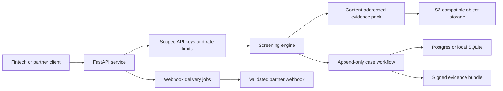

# Architecture

## System Context

## Component Boundaries

| Boundary | Responsibility |
|---|---|
| API and authentication | Validate requests, enforce customer scopes, and rate-limit callers |
| Screening | Produce deterministic decisions and evidence from configured sources |
| Evidence storage | Persist content-addressed artifacts separately from workflow state |
| Case workflow | Record append-only analyst events and review decisions |
| Bundle signing | Produce verifiable exports with key identifiers for rotation |
| Webhook worker | Deliver events asynchronously with SSRF protections and retries |

## Trust Boundaries

- Client input is untrusted and validated before screening.
- API keys are customer-scoped; administrative and evidence-read permissions are separate.
- Webhook destinations are untrusted and must resolve to HTTPS public endpoints.
- Object storage and database credentials are runtime secrets, never repository content.
- The analyst console should be disabled or protected by edge authentication in production.

## Key Tradeoffs

- SQLite and local object storage support a reviewer-friendly local mode; Postgres
  and S3-compatible storage are the intended production posture.
- Evidence artifacts are immutable and content-addressed, while case workflow
  state remains queryable and append-only.
- Signed bundles improve tamper evidence but do not replace source-data assurance
  or independent sanctions-provider validation.
