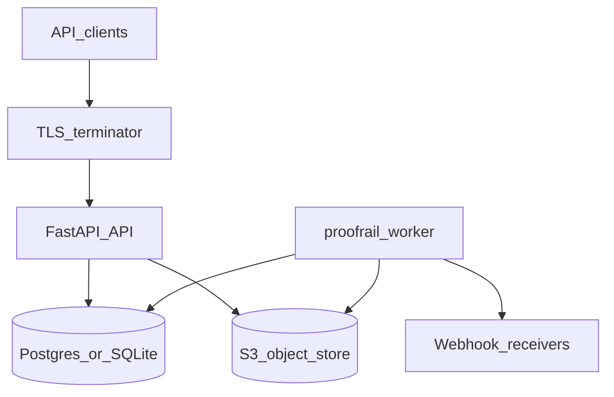

# Threat model — ProofRail Evidence API (repo snapshot)

**Scope**: FastAPI service (`ProofRail/service`), background worker, SQLite or Postgres persistence, S3-compatible object storage, outbound webhooks.  
**Out of scope**: Partner bank core systems, sanctions list provider internals, physical access to datacenters.

## Trust boundaries

## Assets

| Asset | Sensitivity |
|-------|-------------|
| API keys (`x-api-key`) | High — bearer credentials |
| Admin key | Critical — full admin surface |
| Signing secrets / key map | High — forgeable evidence if leaked |
| Evidence packs and blobs | High — regulated screening context |
| Postgres rows (screenings, cases, jobs) | High — PII and decisions |
| Webhook subscription secrets | High — HMAC verification |

## Attacker capabilities (assumed)

- Internet client able to call public API routes and receive responses.
- Ability to guess or replay requests (no shared secret).
- Compromised but valid API key for one tenant (insider or leak).

## Threats and mitigations

| Threat | Abuse path | Mitigation (implemented) | Residual |
|--------|------------|--------------------------|----------|
| Credential stuffing / invalid key probe | High volume of bad keys hits DB | Pre-auth IP rate limit before `resolve_api_key`; bounded limiter memory | Distributed botnet — use edge/WAF |
| Evidence tamper at rest | Disk/object corruption or attacker with storage creds | `get_pack` verifies SHA256 vs `evidence_pack_id` | Storage account takeover |
| Replay of mutating calls | Network retries duplicate side effects | Idempotency-Key on key POST routes | Clients not sending keys |
| Webhook forgery | Attacker posts fake events to receiver | HMAC with per-subscription secret | Secret leakage |
| Admin key brute force | Timing or online guessing | `hmac.compare_digest`; rate limit at edge | Offline if key weak |
| Multi-tenant signing bleed | One secret signs all tenants | v2 keyed signing map; global v1 secret documented risk | Per-customer derived keys optional |
| Queue stuck work | Worker crash mid-lease | Expired lease release in worker; stale lease metrics | Very long lease misconfiguration |
| Oversized verify payload | CPU DoS on canonical JSON | Size cap on verify request; `Content-Length` guard | Chunked huge bodies — ASGI limits |

## Review cadence

- Refresh this document after **major auth, storage, or webhook** changes.
- Link pen-test findings to sections above when reports arrive (see `docs/compliance/README.md`).
